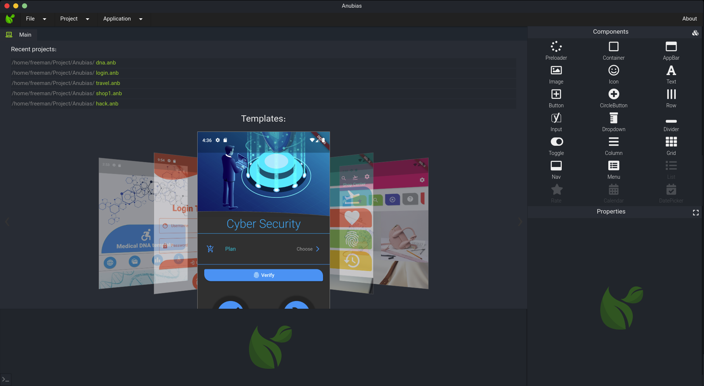
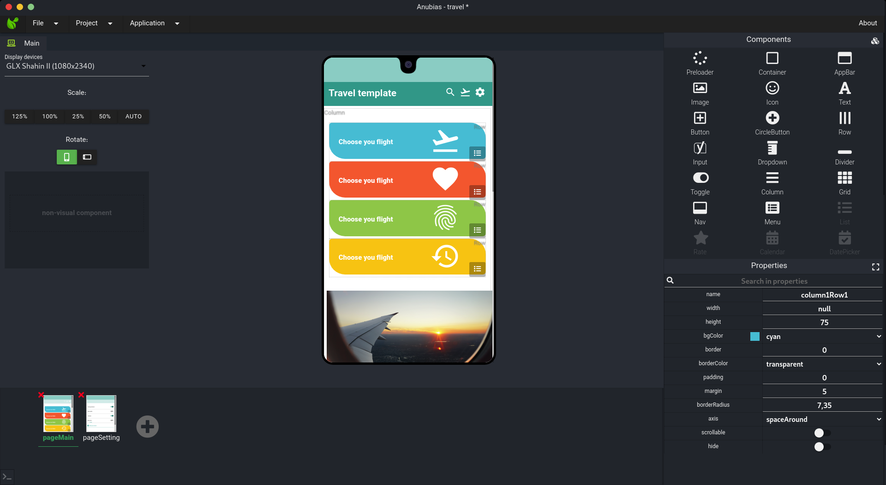
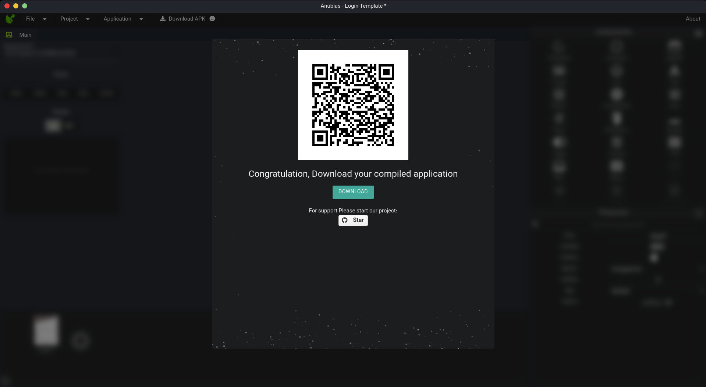
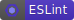

<h1 align="center">
  <br>
  <a href="https://anubias.app/">
    
  </a>
  <br>
  <a href="https://anubias.app">Anubias Desktop</a>
  <br>
  <hr>
</h1>

<div align="center">

[](https://snapcraft.io/anubias)

</div>

# Anubias-Desktop

Anubias is project help you to make your mobile apps so easy and native with GUI : )


# Demo

<div align="center">
<h2>Free Templates</h2>

</div>
<div align="center">
<h2>Easy To Use</h2>

</div>
<div align="center">
<h2>Compile Fast</h2>

</div>

# Downloads
The latest version is available for

* [Windows](https://anubias.app/dl/wini) ([portable](https://anubias.app/dl/winp))
* [macOS](https://anubias.app/dl/mac)
* [Linux](https://anubias.app/dl/linux)
* [WebApp](https://anubias.app/demo)

## Badges

<div align="center">

[](https://anubias.app/)
[](https://GitHub.com/4xmen)
[](https://xstack.ir)
[](https://4xmen.ir)
[](https://Telegram.me/Devefun)

</div>

## 🔗 Links
https://anubias.app/
<br>
http://4xmen.ir/
<br>
https://xstack.ir
## Developing Languages

<div align="center">

[](https://www.javascript.com/)
[](https://vuejs.org/)
[](https://webpack.js.org/)
[](https://eslint.org/)
[](https://www.electronjs.org/)

</div>

## Features

* 📱 Mobile Apps ( Develop your app for : Andriod , IOS )
* 🖥️ Desktop Apps ( Develop your app for : Windows , Linux , MacOSX )
* 🌐 Web applications ( Develop your web app )
* 👉 GUI ( GUI drag and drop component )
* 👨‍💻 xScript ( xScript code look like javascript )
* 💯 Free ( Totally Free )


## Linux Installation

Install form linux Snapcraft Store

```bash
  snap install anubias --classic
```

## Report Some Bugs
Find a Bug? Please, [create an issue](https://github.com/4xmen/Anubias-Desktop/issues) and we'll fix it together for a better template.

## Contribution
Contribution are always welcome and recommended! Here is how:

- Fork the repository ([here is the guide](https://help.github.com/articles/fork-a-repo/)).
- Clone to your machine git clone https://github.com/YOUR_USERNAME/Anubias-Desktop.git
- Make your changes
- Create a pull request


## License

[](https://opensource.org/licenses/GNU)


[GPL](https://www.gnu.org/licenses/gpl-3.0.en.html)


## Support

[](https://www.paypal.me/swepc)

<div align="center"> Developed With Love ! ❤️</div>
